# 【特別対談】山田尚子×新海誠が語り合う、創作論から監督ならではの悩みまで――

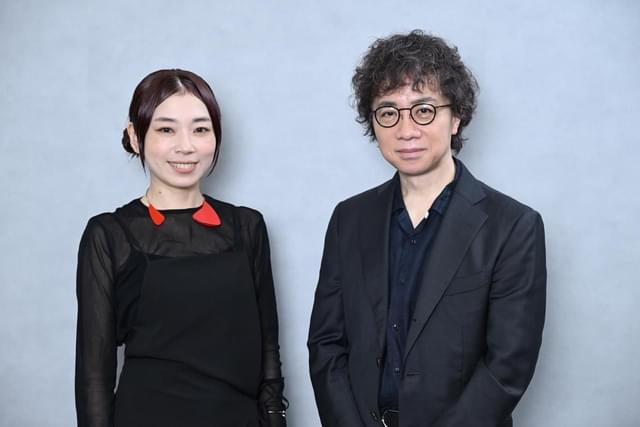

「けいおん！」「映画　聲の形」「リズと青い鳥」「平家物語」等で知られる山田尚子監督が、オリジナル劇場アニメーション映画を創り上げた。人が色で見えるトツ子と才色兼備のきみ、音楽好きのルイの3人がバンドを組む「きみの色」（8月30日公開）だ。公開に先立ち、「君の名は。」「天気の子」「すずめの戸締まり」の新海誠監督との特別対談が実現。独自の“色”を持つふたりが、創作論から監督ならではの悩みに至るまで、とことん語り合った。（取材・文／SYO、編集／大塚史貴）

----------

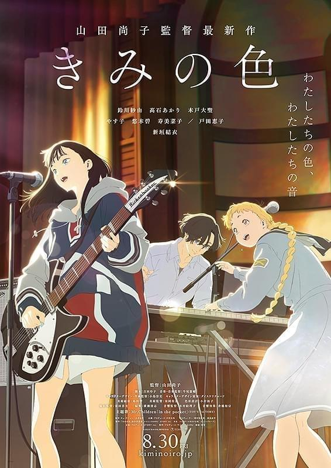

――「きみの色」の製作報告会で、新海監督が山田監督に対して「嫉妬を感じる才能」と仰っていたと伺いました。

新海：僕が最初に山田さんの作品に触れたのは「けいおん！」でした。社会的に大ヒットした作品ですが、アニメーションそのものの新しさや面白さ、楽しさ、可愛さすべてが当時衝撃で「キャリアや世代がかけ離れているような、自分から遠い人が作っているといいな」と思っていたんです。自分と全く違う属性の人が作っているなら耐えられるかもしれないけど、才能自体にはものすごく嫉妬しちゃうと思ったのが最初の印象でした。

山田：私にとっての新海さんはなかなか越えられない壁で、どこまで行っても逃れられない方です。何か作品を作るときに「どういった世界観やルックにしていこう」とスタッフさんと話し合いますよね。その際に「綺麗な空が描きたい」「レンズを意識した画を作りたい」と言ったとき、ぱっと皆さんが想像するのは新海誠の空やレンズ感なんです。そもそも皆さんの仕事机に新海さんの画集が置いてあるので「義務教育なのか!?」って（笑）。それを開かせないところから私の仕事が始まります（笑）。

新海：プライベートで最初に山田さんにお会いした際に、その話を伺って驚きました。僕はアニメ業界出身ではないため同業者の仲間といえる人はほとんどいませんが、アニメ業界のど真ん中でやってきた人たちが、そんな風にちょっとでも思っていただけているのであれば幸せだなと思いました。僕はとしてはむしろ、山田さんたちの作品を真似している気持ちの方が強いです。たとえばキャラクターが喋っているときに顔じゃなくて足を映すような演出を見て「そこでしか表現できない情感があるんだ」と教えていただき、臆面もなく自分の作品で真似したりしました。

----------

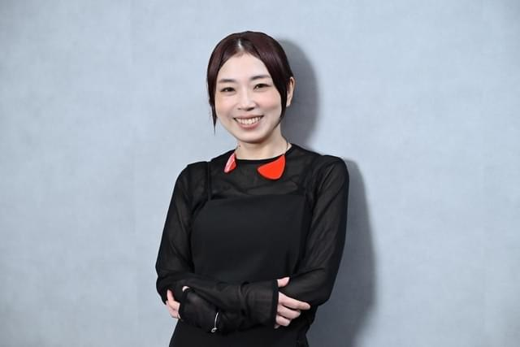

――いまのお話は山田監督がおっしゃっていた「キャラクターが撮られたくないときにわざわざ正面に回って映さない」という意識に通じるのではないでしょうか。「キャラクターとその世界を愛する」ことを大切にされているとお話しされていましたね。

山田：そうですね。いままでの作品の積み重ねで、少しずつ見つかってきたように思います。
――そういった精神性をどのようにスタッフさんに伝えていくのでしょう。

山田：どういったセクションの方にお話しするかで変わってくるため、色々な人格を持っています。それは新海さんも同じかと思いますが、照れないように話すのは大事にしています。基本的に私はふざけてしまってまっすぐ伝えられない性格なのですが、作品を作るときだけはごまかさずにまっすぐに物事を伝えるようにしています。

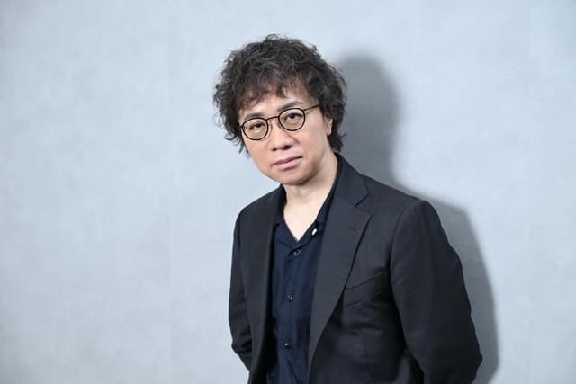

新海：京都人のコミュニケーションのような「2杯目のお茶を出されたら帰らないといけない」みたいな技を使うことはありますか？

山田：「歌上手なんどすなぁ、ピアノ好きなんどすなぁ」みたいに遠回しに表現するやつですよね。それをしちゃうと怖がられてしまうので、裏の意味を持たせないようにもまっすぐ伝えるようにしています。

新海：なるほど。スタッフとのコミュニケーション術でいうと、現場には様々な方が集まるため、思い通りに行かないこともよくありますよね。ただ、参加してくれるスタッフは作品にある種共鳴して「これだったら描ける・描きたい」という人たちが集まってくれているはずなので、根本的なハードルは自分の能力不足によるものだと常に受け止めています。なので、「良い絵コンテを描けない」「企画の魅力が全然足りない」といった創作上の苦労はもちろんありますが、どちらかというと、「数ある現場の中で、スタッフの方々が自分たちの作品のほうを魅力的に感じて選んでくれるだろうか」という不安のほうが常にあります。

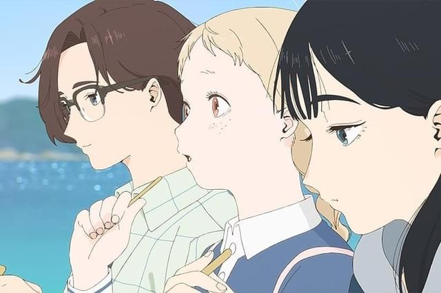

山田：チームが決まっているわけじゃないのは、本当に怖いですよね。

新海：だけど、山田さんに「きみの色」のキャラクターデザイン／作画監督を務めている小島崇史さんを紹介してほしい、と何度言っても断られるんです（笑）。

山田：ガードしています（笑）。本当は私が断れるものではなく、小島さんが新海さんに会いたいならそうなるのでしょうが、その時は私も一緒に行かせてください！とお願いしています。

新海：こういった部分は、普段なかなか表に出ないお話かもしれませんね。監督同士の対談自体、なかなかありませんから。

----------

――先ほど山田監督が新海作品の美しさを話されていましたが、新海監督はかつて「日常を肯定したいから美しく描く」と仰っていましたよね。そのマインドは今も変わらずなのでしょうか。

新海：だいぶ変わってきたように思います。いま挙げていただいたエピソードは、90年代にゲーム会社に勤めていて、満員電車に乗って終電で帰ってくるような生活をしているなかで生まれてきた感情でした。会社では剣と魔法の世界といったファンタジー系の映像を作っていたのですが、僕が毎日使っているコンビニや自動改札、マンションの建設で使うクレーン車といったものを描く仕事が当時の自分にはなく、そっちを描きたいというのが創作の初期衝動だったように思います。だけど、あの頃の「自分の周りの世界を映し取りたい」という気持ちは作品を重ねるごとに気が済んできたところがあり、モチーフも変わってきました。いまの僕は、アニメーション制作をどこか公共事業のように捉えています。お役所仕事という意味ではなく、アニメ映画は必要とする予算や人員、興行的にも今や大規模になっているので、「お金を使って何百人、何千人を巻き込んで行う公共性のある行い」という認識になってきました。海外のディストリビューターと組む機会も増えましたし、自分の表現だけではない意味合いを帯びてきていて、その状況を楽しんでいる自分がいます。

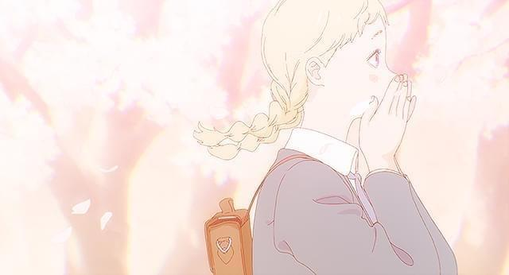

山田：新海さんはずっと「僕」を描き続けていている人だと思っています。そうした方が「世界を背負っている」自覚を得たのには、どういった心境の変化があったのでしょう。

新海：最初の頃はやっぱり「世の中にない、自分だったら作れるものを表現したい」という想いがありましたが、作品を重ねるごとに「作る理由」や「面白さ」を他の部分に探し始めるようになりました。同じようなことをやり続けても飽きてくるし、自分の中で淀んでくるものがあって。そこで「作品の外側にテーマを探そう」と思い始めたのが、この10年くらいでした。そんな感じで、「君の名は。」「天気の子」「すずめの戸締まり」辺りは、徐々に別のつくるフレームを見つけ始めた時期でした。年を取ってきた事にも重なると思いますが、純粋なクリエイティブとは違うところもだんだん見始めたように思います。山田さんは初期と今で、変わってきましたか？

山田：変わってきてはいるかと思いますが、変わっていてほしくないという思いもあります。自分は映画に対する尊敬や憧れをずっと変わらず持っていたいし、今も持てているのでそこはクリアできたとは思っています。キャラクターや作品世界を大切にしていく思いについても、大人になりたくないといいますか――賢くなりたくない、とは思っています。

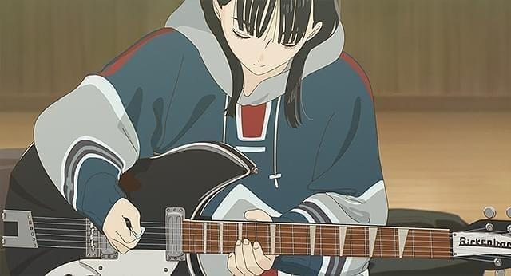

新海：映像作品の数は世の中にどんどん増えていますよね。しかもいまや全部アーカイブされるため、流れていかずにストックされる分母がどんどん大きくなっていく。そうなると、自分が全力で作った作品の意味合いが相対的に薄くもなっている気持ちもあるんです。みんなが無数に浴びているエンタメの1個でしかないという気持ちが、どうしても強くなってきてしまって。そんな流れがあるからこそ、パッケージとしての座組み、企画の魅力といった突破力に自分の意識がシフトしてきたようにも思います。自分のクリエイティブが段々とビジネス寄りになってきたこと自体も楽しんではいますが、山田さんには自分の作品の相対的な形が薄くなってしまっている虚無感はありますか？

山田：それでいうと、私は純度が高くなってきているかもしれません。自分は完全に作る人に徹したいから、宣伝して下さる方やプロデュースして下さる方がいるなら、全部それを預けたいと思うようになりました。私はきっと、観てくれる人を信じすぎるところがあって、朴訥とした感覚をどんどん掘り下げようとしている気がします。昔はもっと「作品がどう売られていくのか・どう見せていくべきか」といった外側が気になっていましたが、むしろ作品しか見ないようになってきました。

新海：そっちの方がカッコいいと思います。

山田：いえいえ、あまりにも情報が多すぎるからプロテクトし始めただけです。自分の手に収められるものを1番大事にしようという感覚になってきました。

----------

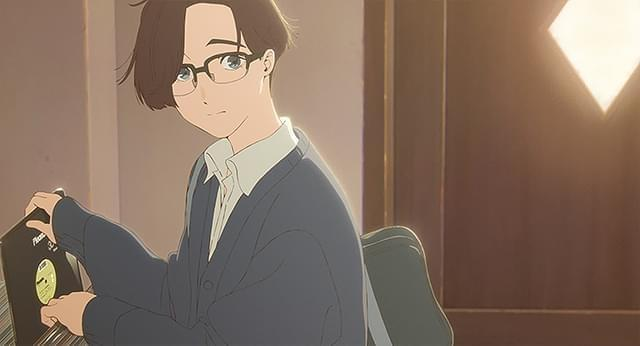

――ちなみに山田監督は「自分はオリジナル気質じゃない」と仰っていましたよね。「きみの色」でオリジナル作品に挑戦されて、どんな違いを感じられたのでしょう。

山田：原作があるということは、そこに一つ指針というか柱があるし、原作に対する責任も生じます。この作品に対してアニメーションの映像として何ができるかをまっすぐ考えるだけでよかったのですが、オリジナルはまず責任を持つところから始まるのですごく怖かったです。シンプルに面白くないとダメだけど、それが出来る自信が自分にはなくて。ただ、いざ作り始めてみると、何物になるかもわからないものに対してたくさんのスタッフの方が全力で携わってくれているわけで、そこにちゃんと報いて嘘のない作品にしていきたいという思いが出てきました。オリジナル作品を作るのはすごく難しいし怖いことだけれど、とってもエキサイティングなものなのだと知ることができました。

新海：僕からすれば、自分が原作ものをやったことがないこともあり、そちらの方が怖いです。山田さんは原作を壊さないような、或いはさらに魅力が増すようなお仕事をずっとやられてきて、山田さんが作ることで原作のファンがさらに膨らむことをずっと重ねてきた凄みを感じます。自分に経験がないため、未知の恐怖を感じますね。
――先ほど新海監督がお話しされていた「公共事業」は、オリジナルと結びつく思考の気もしました。ゴールを自分たちで設定できる自由度があるといいますか。

新海：そうかもしれません。どこにも存在していなかった巨大な建築物のようなものを作っている感覚があります。ねじの締め方やどういう材料で作るか、外観も含めてまだこの世に存在していないものを創り上げるロマンがあります。今は、完成するフィルムはデータですから形こそありませんが、気分としてはそういった思いがあり、それがオリジナルを作る醍醐味ではと思います。

山田：「きみの色」を経験して、それがよくわかりました。オリジナル気質ではないと言いつつ、この作品が世に生まれた感動をものすごく感じて、「これは癖になるだろうな」と思いました。

----------

――「きみの色」の企画は、「音楽ものをやりたい」が出発点だったと伺いました。山田監督は「けいおん！」「リズと青い鳥」と音楽モチーフの作品を多く手掛けられてきた印象があるのですが、全く違うジャンルではなく重ねたのはなぜでしょう。

山田：オリジナル作品を劇場映画として作ることにプレッシャーを感じすぎてしまい、自分が地に足を着けて取り組める題材で描きたいなと思ったんです。無理して大きな話にチャレンジする必要はないんじゃないか、と考えたとき、「音楽を奏でる人たちの作品が作りたい」というものが出てきました。嘘をつかず、カッコつけず、やりたいことをシンプルにやりたいですと言おうと思った結果です。

新海：「きみの色」を観て好きな瞬間はたくさんありましたが、中でも一番好きなのは文化祭でライブをする直前のシーンです。演奏を控えて「ライブなんかしてよかったのかな」と緊張しているきみちゃんに、トツ子が「何言ってるの、そんなやる気満々の格好して」というシーンがありますよね。きみちゃんが身を起こすと、確かにファッションはロックにびしっと決めている。コミカルでキャラへの愛情溢れる素敵な処理だと感じたんですが、こうやって山田さんのお話を聞いていると、ご本人にもそうした複雑な可愛らしさを感じます。

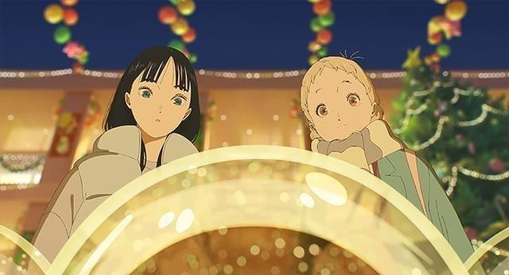

山田：ありがとうございます。「私なんかできません」と言いながら意外と図々しいのって、すごく可愛いなと私も思います。キャラクターは自分の知らない人なので、知ろうとする感覚で「この人はこういう人」というものを観察させてもらっています。

新海：脚本の吉田玲子さんを観察している感覚とはまた違うものですか？

山田：吉田さんは眩しすぎて見られません（笑）。長い間ご一緒していますが、不思議な方で光って見えないんです。私と彼女はお互い踏み込まないし、良い意味でずっと距離が変わらない関係です。

新海：僕は脚本も自分で書いているので、そうした関係性の経験がなくて単純に興味本位で聞きたいのですが、――吉田さんは他の映画の脚本も書いていますよね。「それ禁止！」みたいな思いはありますか？

山田：ありますよ。私が一番吉田玲子に上手く乗れる！と声を大にして言いたいです。でも吉田さんはそんなの関係なく色々な方とご一緒されますから。

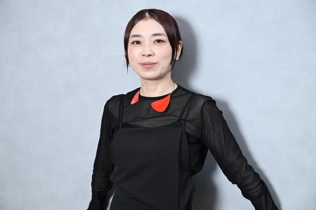

新海：僕はRADWIMPSに同じことを感じます（笑）。僕が一番RADに上手く乗れるんだ！という気持ちはあるけど、様々な映画に参加されているから……。

山田：我々監督は待っている立場で、選んでもらわないといけませんからね。

新海：そうなんですよ。こういう人たちとこういうことをやりたいと声を掛けますが、強制はできませんから。最終的には選んでもらわないといけない。

山田：「断られたらどうしよう」と常に不安ですし、吉田さんが山田との仕事に飽きてしまったらどうしよう……と常に湿っぽい感情を持っています。

----------

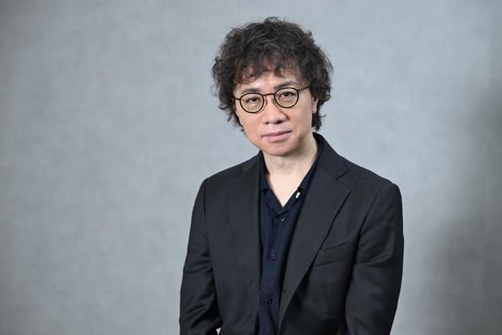

――まさに監督のお立場ならではの悩みですね。

新海：キャストに対してもありますよね？　例えば、冗談半分ですが上白石萌音さんには「君の名は。」の三葉以外をやらないでほしいと思ったり（笑）。

山田：そうした思いが強すぎて、自分の次の作品でキャスティングできないこともありますよね。でも、神木隆之介さんは複数作品に出ていらっしゃいますね。

新海：ご一緒した方々が遠い場所で眩しく活躍していることの喜びもあるのでもちろん応援し続けてはいますが、一方で僕が神木くんに上手く乗れるんだ！　と思ってしまう気持ちはどうしてもありますね（笑）。気遣いもあるかもしれませんが、たまに役者さんが「僕は新海組出身だから」と言って下さるのを聞くと、一生そう言い続けてほしいと願っています。

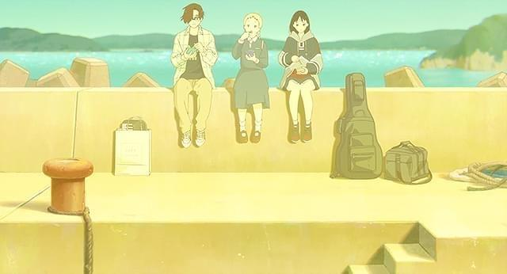

山田：たまにテコ入れしに行くんですよね。定期的に連絡を取って「君は何組だっけ？」って（笑）。でも、新海さんは出演された方々とすごく仲良くなる印象なので羨ましいです。秘訣はあるんですか？

新海：特にテクニックとかはなく、むしろ出演者の皆さんに聞いてみたいくらいです。たとえば、山田さんを紹介してもらったのは入野自由さんなんですが、入野さんは僕の「言の葉の庭」と山田さんの「映画　聲の形」に出演されているので、僕と山田さんどっちが好きなのか聞いてみたいです（笑）。

山田：確かに（笑）。今回の対談に際して、新海さんに会えるからと「言の葉の庭」を見返したら入野くんの声がしてきて、どっちがいいところを引き出せるのかは気になるところです。でも「言の葉の庭」の方が先だからな……。

新海：入野さんには「あの日見た花の名前を僕達はまだ知らない。」のキャラクターデザインの田中将賀さんも紹介してもらって、そのご縁で「君の名は。」に参加していただいたんです。そう考えると、実は全部入野さｎがコントロールしているのかもしれない（笑）。

山田：そうかもしれません。彼がすべてを握っている（笑）。

----------

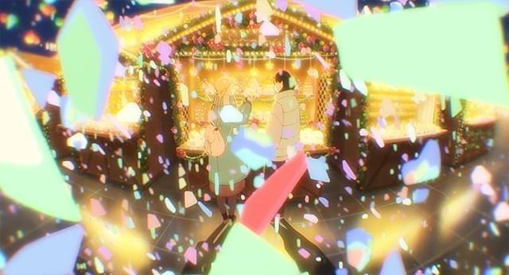

――先ほどのお話にもありましたが、山田監督は「観客を信じる」を信条にしていらっしゃいますよね。その部分、新海監督のお考えをお聞きしたいです。

新海：山田さんのそういった言葉や、キャラクターの実在を信じて誠実に撮っていく眩しさにいつもハッとさせられる反面、どうやったらそれが可能なのか僕は未だにわかりません。観客のことはもちろん大切だし信じてもいますが、「この表現が観客に伝わるかどうか」を考えたときに、伝わらないかもしれないリスクを考えてしまい、そういった表現を回避する方向にいってしまうことがあります。だけど、山田さんは観客を信じているからこそ説明描写などを削り取ってよりピュアなものにできるのだと感じています。僕自身には真似する度胸もできないのでその根拠が山田さんのどこにあるのか気になっています。

山田：自分が映画を観るときの気持ちに帰ってきている気がします。自分は映画と勝負したいし、能動的に楽しみたいタイプ。止ませたり考えさせてほしいという気持ちが昔からあるのですが、たくさん答えがあるほうが観やすかったり親切で心を動かせたりするようなとは思いつつ、今話したような映画体験も肯定したくて踏ん張っている感じです。「こういう映画があってもいいのではないでしょうか」という気持ちです。

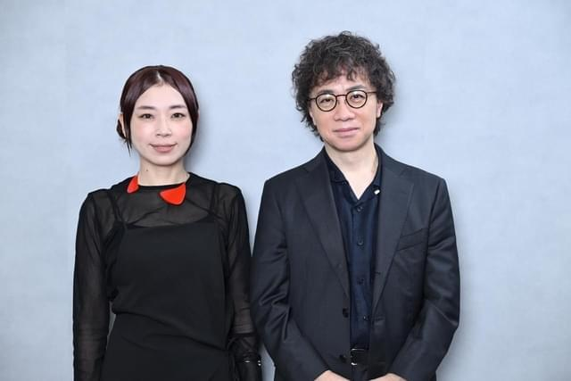

新海：それはすごく勇気がいることだし、周りも説得しないといけませんよね。だから山田さんはタフな人なのだと思います。お酒を飲んでいてもずっと変わらないし、体幹の強さを感じます（笑）。

山田：道産子といいますか、土地に根付いた感じですね（笑）。そう言っていただけて、とても有り難いです。新海さんは私にレッテルを張らずに観てくださるイメージがあるので、凄く助かっています。

新海：いえいえ、本当に数少ない監督の友人のおひとりですから。対談のお話をいただいたときに、山田さんとだったら――という気持ちはありました。

山田：本当に嬉しいです。冒頭にお話しした通り、新海さんには苦情ばかり言っているのですが（笑）、こうやって作品について話す機会はなかなかないですから。こうやってお話して、私が新海さんの作品をどう見ているのかが自分で分かった気がしました。貴重な機会をありがとうございました。

新海：僕も山田さんの作品を観ていて「ここ良いな、真似したいな」と思うところは色々とありますが、こういう機会でもないとなかなか言語化できないので、こちらこそありがとうございました。
